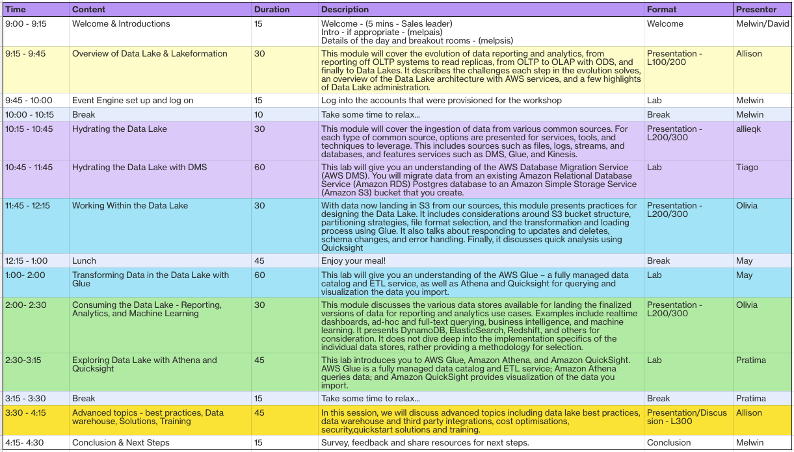

# AWS Data Immersion Day
This is a helper page for immersion day on July 19th 2022.

### Agenda
The agenda is as below; time is in AEST and is subject to change depending on the progress.

### Labs
[Data Engineering Immersion Day](https://catalog.us-east-1.prod.workshops.aws/workshops/976050cc-0606-4b23-b49f-ca7b8ac4b153/en-US) will be used for the event. 
*Only* the following topics will be covered.

0. Account set up: 
    * [Introduction](https://catalog.us-east-1.prod.workshops.aws/workshops/976050cc-0606-4b23-b49f-ca7b8ac4b153/en-US/100-introduction) 
    * [Workshop at an AWS Event](https://catalog.us-east-1.prod.workshops.aws/workshops/976050cc-0606-4b23-b49f-ca7b8ac4b153/en-US/100-introduction/30-region-selection)
1. **Data Ingestion**: 
    * [DMS Migration Lab](https://catalog.us-east-1.prod.workshops.aws/workshops/976050cc-0606-4b23-b49f-ca7b8ac4b153/en-US/400/401/430-main-lab) 
    * **Optional** [CDC part](https://catalog.us-east-1.prod.workshops.aws/workshops/976050cc-0606-4b23-b49f-ca7b8ac4b153/en-US/400/401/430-main-lab#create-the-cdc-endpoint-to-replicate-ongoing-changes-(optional))
2. **Transformation**: 
    * [Data Validation and ETL](https://catalog.us-east-1.prod.workshops.aws/workshops/976050cc-0606-4b23-b49f-ca7b8ac4b153/en-US/600/610-glue-data-validation-etl)
3. **Query and Visualise**: 
    * [Athena and QuickSight](https://catalog.us-east-1.prod.workshops.aws/workshops/976050cc-0606-4b23-b49f-ca7b8ac4b153/en-US/800/810-athena-quicksight) 
    * [Athena Federated query](https://catalog.us-east-1.prod.workshops.aws/workshops/976050cc-0606-4b23-b49f-ca7b8ac4b153/en-US/800/820-athena-federated-query)

The participants are free to explore other areas however the support staff will prioritise queries from predefined labs.

### Housekeeping
  * Use AWS account provided by event host (not your company/personal account)
  * Please do not use company/personal datasets
  * Light breakfast, lunch and snacks will be provided
  * Top 3 winners of Quiz will receive prizes!
  * Paul will organise the SWAG.

